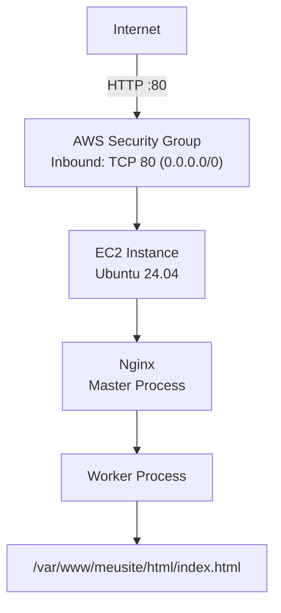

# Deploy de Website Estático com Nginx na AWS EC2

Este guia apresenta um passo a passo para provisionar uma instância EC2 na AWS, configurar as regras de segurança de rede e implantar uma página estática utilizando o Nginx como servidor web. Baseado no [Beginner's Guide](https://nginx.org/en/docs/beginners_guide.html) oficial do Nginx.

---

## Pré-requisitos

- Conta ativa na AWS (free tier é suficiente para este tutorial)
- Navegador web moderno (Chrome, Firefox ou Edge)
- Conhecimento básico de terminal Linux

> Neste tutorial, o acesso ao terminal da instância será feito diretamente pelo **Console AWS via navegador**, utilizando o **EC2 Instance Connect**, sem necessidade de instalar cliente SSH ou gerenciar arquivos `.pem` localmente.

---

## 1. Criando a Instância EC2

### 1.1 Acessar o Console AWS

1. Acesse [https://console.aws.amazon.com](https://console.aws.amazon.com) e faça login.
2. No menu de serviços, selecione **EC2**.
3. Clique em **Launch Instance**.

### 1.2 Configurar a Instância

Preencha as configurações conforme abaixo:

| Campo | Valor recomendado |
|---|---|
| Name | `nginx-static-server` |
| AMI | Ubuntu Server 24.04 LTS (HVM), SSD Volume Type |
| Instance type | `t3.micro` (free tier eligible) |
| Key pair | **Proceed without a key pair** |
| Storage | 8 GiB gp3 (padrão) |

> Como utilizaremos o **EC2 Instance Connect** para acesso via navegador, não é necessário associar um key pair à instância.

---

## 2. Conectando à Instância pelo Console AWS (EC2 Instance Connect)

O **EC2 Instance Connect** permite abrir um terminal diretamente no navegador, sem cliente SSH local nem gerenciamento de chaves. A AWS injeta uma chave temporária na instância, via canal interno, a cada sessão.

1. No **EC2 Dashboard**, acesse **Instances** e selecione a instância `nginx-static-server`.
2. Aguarde o estado mudar para **Running** e o **Status check** indicar **2/2 checks passed**.
3. Clique em **Connect** (botão no topo do painel).
4. Selecione a aba **EC2 Instance Connect**.
5. O campo **Username** deve estar preenchido com `ubuntu`.
6. Clique em **Connect**.

Uma nova aba do navegador será aberta com um terminal totalmente funcional conectado à instância.

> **Requisito:** A AMI deve ter o pacote `ec2-instance-connect` instalado. O Ubuntu Server 24.04 LTS da AWS já vem com ele pré-instalado.

---

## 3. Preparando o ambiente no Ubuntu

Após conectar, atualize os pacotes do sistema antes de qualquer instalação:

```bash
sudo apt update -y
```
---

## 4. Instalando o Nginx

```bash
sudo apt install nginx -y
```

Verifique se o serviço está ativo:

```bash
sudo systemctl status nginx
```

A saída esperada deve incluir `active (running)`. Caso contrário, inicie o serviço manualmente:

```bash
sudo systemctl start nginx
sudo systemctl enable nginx  # habilita inicialização automática com o sistema
```

## 5. Acessando o site padrão do Nginx

Ao ser instalado, o Nginx exibe uma página padrão, indicando que a instalação foi bem-sucedida. 
Para acessar essa página, copie o IP público ou DNS público da instância e digite no navegador, adicionando o protocolo http://

```
http://IP-PÚBLICO
```
ou 
```
http://DNS-PÚBLICO
```

Você consegue visualizar o site?

---

## 6. Configurando o Security Group

O Security Group funciona como um firewall virtual que controla o tráfego de entrada e saída da instância. Para este tutorial, precisamos liberar as portas SSH e HTTP.

### 6.1 Definindo as Regras de Entrada (Inbound Rules)

Na seção **Network settings** durante a criação da instância, clique em **Edit** e adicione as seguintes regras:

| Type | Protocol | Port Range | Source | Descrição |
|---|---|---|---|---|
| HTTP | TCP | 80 | Anywhere (0.0.0.0/0) | Tráfego web público |

> O acesso administrativo será feito via **EC2 Instance Connect** diretamente pelo Console AWS, que injeta uma chave SSH temporária na instância por um canal interno da AWS — sem necessidade de liberar a porta 22 no Security Group.

### 6.2 Verificando o Security Group após criação

Após a instância ser criada, você pode revisar e editar o Security Group em:

**EC2 Dashboard > Security Groups > Selecione o grupo > Inbound rules > Edit inbound rules**


---

## 7. Entendendo a Estrutura do Nginx

O Nginx opera com um **processo master** responsável por ler e avaliar a configuração, e múltiplos **worker processes** que lidam com as requisições. O arquivo de configuração principal no Ubuntu fica em:

```
/etc/nginx/nginx.conf
```

A estrutura de configuração é baseada em **diretivas** organizadas em **contextos**:

```
main context
└── events { }
└── http {
    └── server {
        └── location / { }
    }
}
```

Diretivas simples terminam com `;`. Diretivas de bloco agrupam outras diretivas dentro de `{ }`. Comentários são precedidos por `#`.

No Ubuntu, os sites disponíveis ficam em `/etc/nginx/sites-available/` e os ativos (habilitados via symlink) em `/etc/nginx/sites-enabled/`.

---

## 8. Criando e Implantando a Página Estática

### 8.1 Criar o diretório raiz do site

```bash
sudo mkdir -p /var/www/meusite/html
```

### 8.2 Criar a página HTML

```bash
sudo nano /var/www/meusite/html/index.html
```

Cole o conteúdo abaixo:

```html
<!DOCTYPE html>
<html lang="pt-BR">
<head>
    <meta charset="UTF-8">
    <meta name="viewport" content="width=device-width, initial-scale=1.0">
    <title>Meu Primeiro Site com Nginx</title>
    <style>
        body {
            font-family: Arial, sans-serif;
            display: flex;
            justify-content: center;
            align-items: center;
            height: 100vh;
            margin: 0;
            background-color: #f0f0f0;
        }
        .container {
            text-align: center;
            background: white;
            padding: 2rem;
            border-radius: 8px;
            box-shadow: 0 2px 10px rgba(0,0,0,0.1);
        }
        h1 { color: #333; }
        p { color: #666; }
    </style>
</head>
<body>
    <div class="container">
        <h1>Deploy com Nginx na AWS EC2</h1>
        <p>Servidor web funcionando com sucesso.</p>
    </div>
</body>
</html>
```

Salve com `Ctrl+O`, `Enter`, `Ctrl+X`.

### 8.3 Ajustar permissões

```bash
sudo chown -R www-data:www-data /var/www/meusite
sudo chmod -R 755 /var/www/meusite
```

---

## 9. Configurando o Virtual Host no Nginx

### 9.1 Criar o arquivo de configuração do site

```bash
sudo nano /etc/nginx/sites-available/meusite
```

Insira a seguinte configuração:

```nginx
server {
    listen 80;
    server_name _;  # aceita qualquer hostname ou IP

    root /var/www/meusite/html;
    index index.html;

    location / {
        try_files $uri $uri/ =404;
    }

    # Logs específicos para este site
    access_log /var/log/nginx/meusite_access.log;
    error_log  /var/log/nginx/meusite_error.log;
}
```

> O `server_name _;` é uma convenção para capturar requisições sem um hostname específico, adequado para acesso direto via IP.

### 9.2 Habilitar o site

Crie um symlink em `sites-enabled`:

```bash
sudo ln -s /etc/nginx/sites-available/meusite /etc/nginx/sites-enabled/
```

Desabilite o site padrão para evitar conflitos:

```bash
sudo rm /etc/nginx/sites-enabled/default
```

### 9.3 Validar a configuração

Antes de recarregar o serviço, teste a sintaxe do arquivo de configuração:

```bash
sudo nginx -t
```

A saída esperada:

```
nginx: the configuration file /etc/nginx/nginx.conf syntax is ok
nginx: configuration file /etc/nginx/nginx.conf test is successful
```

### 9.4 Recarregar o Nginx

```bash
sudo nginx -s reload
# ou equivalentemente:
sudo systemctl reload nginx
```

O processo master do Nginx valida a nova configuração antes de aplicá-la. Se houver erro, ele mantém a configuração anterior — sem downtime.

---

## 10. Testando o Deploy

Abra o navegador e acesse:

```
http://<PUBLIC_IP>
```

Substitua `<PUBLIC_IP>` pelo IP público da sua instância EC2. Você deve visualizar a página HTML criada.

Você também pode testar via `curl` diretamente na instância ou na sua máquina local:

```bash
curl http://<PUBLIC_IP>
```

---

## 11. Diagnóstico e Logs

Caso o site não esteja acessível, verifique os logs:

```bash
# Log de acesso
sudo tail -f /var/log/nginx/meusite_access.log

# Log de erros
sudo tail -f /var/log/nginx/meusite_error.log

# Log de erros global
sudo tail -f /var/log/nginx/error.log
```

Checklist de diagnóstico:

- O Security Group permite tráfego na porta 80?
- O Nginx está em execução? (`sudo systemctl status nginx`)
- A sintaxe da configuração está correta? (`sudo nginx -t`)
- O arquivo `index.html` existe no caminho configurado em `root`?
- As permissões do diretório estão corretas? (`ls -la /var/www/meusite/html`)

---

## 12. Controle do Processo Nginx

O Nginx aceita sinais de controle via o executável ou `systemctl`:

```bash
# Parada imediata
sudo nginx -s stop

# Parada graciosa (aguarda requisições em andamento)
sudo nginx -s quit

# Recarregar configuração sem downtime
sudo nginx -s reload

# Reabrir arquivos de log (útil para rotação de logs)
sudo nginx -s reopen
```

---

## Resumo da Arquitetura



--- 

## FAQ

### Não consigo acessar o meu site implantado na AWS. 
1. Confirme que o site está funcionando localmente com o comando `curl 127.0.0.1`.
2. Confirme que o _security groups_ da instância utilizada está com a liberação da porta utilizada (porta 80 -> 0.0.0.0/0)
3. Confirme que está usando o ip público ou DNS público para acessar a máquina.
4. Os navegadores modificam automaticamente a requisição para https. Visualize na barra de endereço se a requisição está `http://...`

## Referências

- [Nginx Beginner's Guide](https://nginx.org/en/docs/beginners_guide.html)
- [Nginx Core Module](https://nginx.org/en/docs/ngx_core_module.html)
- [AWS EC2 Documentation](https://docs.aws.amazon.com/ec2/)
- [Ubuntu Server Guide](https://ubuntu.com/server/docs)
